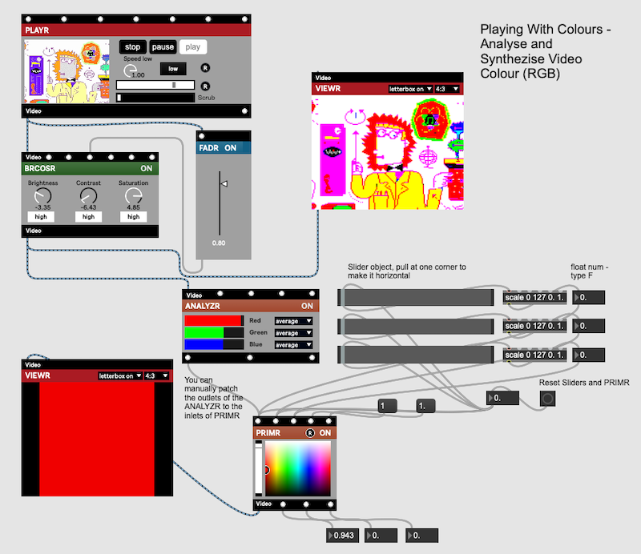

## Video With VIZZIE and Jitter

MAX can also work with videos. For this purpose it provides a new family of objects called *Jitter*. You can identify them as their names are starting with `jit. ...`. For an easier learning experience, they have also been packaged into modules, named VIZZIE. Both Jitter objects and VIZZIE modules are an integral part of MAX, so you can combine them with MAX objects to control everything and MSP or BEAP modules to add sound. 

This session is designed around the four introductory videos from the Cycling'74 website. You can access the videos by clicking on the title of each of the sections below. In most cases, you just follow the screenshots and instructions to patch the projects together. Some of the patches introduced are ready for download in the folder `patches` in this repository.

Happy Patching!


## Session 1: [A Brief Introduction to Vizzie](https://youtu.be/59sFC22NVRA)
This is a first simple patch with a video source and some effects. In order to easily access the modules, click ```v```at the left panel of the Patcher window and then find the module by category or type its name in the Search on top.


The following lists allow you to rebuild the patches in order. Each step is a running patch, try it out to make sure that you have patched everything correctly. Further hints on what to look for can be found in the video.

### 1.1. Simple Player
1. INPUT/PLAYR - Module allows changing the speed, select a part of the video to be played and set a loop.
2. OUTPUT/PROJECTR

##### MAX comes with a video collection. 
You find it also on the left side of the screen.


### 1.2. Add Effects
1. EFFECT/BRCOSR
   Allows modifying the brightness, contrast and saturation of videos.
2. EFFECTS/DELAYR - Delay, apply feedback to the delay and crossfade/mix original and delayed signals.


### 1.3. Add Randomness to the Effects

1. GENERATE/ATTRACTR


## Session 2: Video Effects, Remixes with BEAP, Recording, and Even More VIZZIE

*This session is taking inspiration from*

- [Vizzie Visions: Part 2, BEAP Modules](https://youtu.be/xcs-kKaN6QQ)
- [Max MSP Tutorials for Beginners: Vizzie #4 Effects Tour](https://soundand.design/vizzie-4-effects-tour-b39b3cd4e29)


This patch also demonstrates the different ranges for the various signals and signal amplitudes inside MAX. Often they are derived from existing standards in the analogue world. All values are digitized inside the computer. 

- VIZZIE Data - Floating Point Numbers between 0V .. 1V
- Audio Signals (MSP) -1.0 .. 1.0
- BEAP “Control Voltage” CV -5V .. 5V, used for analogue modular synthesizers
- Ramp (special signal here: 0V .. 5V)

### 2.1 A More Complex Patch, Step by Step

The following lists allow you to rebuild the patches in order. Each step is a running patch, try it out to make sure that you have patched everything correctly. Further hints on what to look for can be found in the video.

#### 2.1.1 Basic Video Patch

1. INPUT/PLAYR
2. TRANSFORM/PIXL8R
3. OUTPUT/VIEWR
4. CONTROL/FADR


#### 2.1.2. BEAP’s LFO controls the PIXL8R

1. In BEAP get LFO/CV LFO
2. Enable Audio with the ON button on the lower right of the patch window.
3. In VIZZIE get UTILITY/BEAPCONVERTR
4. Set in the converter the range to 0..5V.


#### 2.1.3. Add audio source

1. Add audio player
2. add new object (N) live.gain~
3. add new object (N) ezdac~
4. Change range of BEAPCONVERTR to -1V to 1V (audio signal range).


#### 2.1.4. Use ATTRACTR to control the LFO

1. Reconnect the CV LFO from step 2
2. GENERATE/ATTRACTR
3. UTILITY/VIZZIECONVERTR


### 2.2. [Video to Data and Data to Video](https://youtu.be/sbfpLhPTbVI)

Launch the patch “221205_Vid31”.

### What to do?

With no patch cord between ANALYSR and PRIMR, change the three sliders and see what happens.
Next, reset the sliders to zero by clicking on the button and connect one of the three outlets of ANALYSR to one of the three inlets of PRIMR. Pay attention to the labels of both modules when patching. Predict what will happen when you are choosing different scenarios to patch the two modules.



The three sliders allow synthesizing (mix) the three colour components red, green and blue to get whatever colour you like to get. The result can be seen on VIEWR if there is no signal coming from the ANALYSR module. Reset the sliders and the PRIMR module by banging the button before starting to change the values of the sliders.

The ANALYSR module is extracting / analysing the red, green and blue components of the video and giving values between 0.0 (no colour) to 1.0 (fat red/green/blue) . The number stream coming from its outlets, one for each colour, can be fed into the PRIMR module. 

The MAX Documentation has a [Tutorial](https://docs.cycling74.com/max8/tutorials/jitterchapter05) about ARGB Colours (Alpha or Intensity, Red, Green, Blue). Check it out if you want to know more about the subject.

Attention: When you have connected the ANALYSR module to the PRIMR, it will immediately overwrite the settings of the sliders. 


## 4. [Recombinant Patching]( https://cycling74.com/tutorials/vizzie-visions-episode-4-recombinant-patching-made-easy)

Some Vizzie effects are only available as Abstractions (separate patches), they look like normal objects and are not shown on the Vizzie menu. They are implemented as ordinary objects, and are accessible by creating an empty object shell with `n` and then entering their name. You recognize them by the `vz. ...``vz`at `vz``vz` beginning of their name. Each of these effects has a Control Panel that can be opened by double-clicking on the object. 


MAX will show you available options once you have typed ```vz.```.


The video shows you how to get these abstractions and use a matrix (PATCHROUTR) to define a chain of abstractions one executed after the other in an order you describe. Here are two examples.

The first example connects the input and output directly, there are no effects applied. The cell at the junction of IN line and OUT line is selected.


The second example includes one effect. First, the signal is routed from Video In to 4, then from 4 to Video Output. The process of finding the correct cell is similar to identifying (x,y) coordinates, the first value is where the signal is coming from moving along the x axis, the second value where the signal is going to moving along the y axis.


### Where to find the modules?

- INPUT/PLAYR
- CONTROL/PATCHROUTR
- OUTPUT/VIEWR
- The abstractions are created by making a new object and then typing the name of the abstraction, see explanations above.


## Session 3: Under the Hood - Jitter

/Placeholder for content


## Session 4: Some things to try out

### 1. Use Your Webcam With VIZZIE


This project is a remix of project 4, we replace the PLAYR module by the GRABBR module. This object gets a feed from your webcam and a second video signal from the PLAYR. An effect (Kaleidoscope) is applied to the signal from the player. We are using a fader (CONTROL/FADR) to mix two video signals. As output you can see preview the signal “live” on a VIEWR module, you can also record your video with the RECORDR module.


## Some Background Knowledge

### Copyright, Creative Commons, Public Domain, and Fair Use in a Nutshell

#### Copyright

All works (books, music, videos) are protected by law, and another person can only use it if agreed by the creator of said work. When you buy a book, you typically find some limitations on what you can do with it at its beginning. If there is no reference to any rights, the work may still be protected by copyright laws, so you need to get the approval if you want to use it.


#### Public Domain

Works in the Public Domain can be used by whomever as they like. Many of the classics (Shakespeare) are in the Public Domain. [Here](https://en.wikipedia.org/wiki/Public_domain) you find more about it.


#### [Creative Commons](https://creativecommons.org/share-your-work/cclicenses/)

Under the Creative Commons License, the creator keeps the rights (control) on his work, but makes it easier for others to use his work without the need to get directly in touch with him/her. There are different types of sublicenses under this licensing system. The simplest license is a CC-BY license where the person using someone elses work only has to mention/credit/appreciate the original creator of the work. It is important that the creator publishes the proper license he/she wants to grant to others.


#### Fair Use

This is no right/license to use for a work by itself. Many countries allow the use of copyrighted work in very restricted ways for educational purposes, that's called Fair Use. [This](https://www.ipd.gov.hk/filemanager/ipd/common/copyright/FAQs-2007-copyright-exemptions-en.pdf) document describes the situation in Hong Kong (2007). Q3 tries to describe the limits of a Fair Use, copyrighted materials cannot be used for commercial purposes, furthermore, it should be clearly restricted in its quality and quantity to be used for education only.


#### How to find materials you can use?

When you search images on Google, enter your search terms, select `Images` and then click on `Tools`, select 
`Usage Rights`.

When on Youtube, enter your search terms, open the `Filters` section and find the licence link. This video by the [Langara Library CC-BY](https://youtu.be/b7UZELEunow?feature=shared) shows you how to find content under the Creative Commons license in more detail.

When on Vimeo, enter your search terms, open the `Filters` section and find the licence link. This video by the [Langara Library CC-BY](https://youtu.be/lID2eDz4j0g?feature=shared) shows you how to find content under the Creative Commons licence in more detail.


## Source Files in Compressed Format for some more patches.

[This Markdown File](patches/patches.md) contains more patches in a compressed format. Just open a new patcher on MAX, then select the whole text of the patch you want to copy and then copy it. When your mouse hovers over your empty patch, right-click your mouse and `Paste` the content on your patch. After a short while, the patch will become visible. The first thing to do may be saving it, then start to remix it. Please note that the patch only contains the code, you will need to add the media files by yourself.
