## Video With VIZZIE and Jitter

MAX can also work with videos. For this purpose it provides a new family of objects called *Jitter*. You can identify them as their names are starting with `jit. ...`. For an easier learning experience, they have also been packaged into modules, named Vizzie. Both Jitter objects and Vizzie modules are an integral part of MAX, so you can combine them with MAX objects to control everything and MSP or BEAP modules to add sound. 

These sessions are designed around the four introductory videos from the Cycling'74 website. Links to the videos can be found in the sections below. In most cases, you can assemble your patch just following the screenshots and instructions. Some of the patches are ready to download from the folder `patches` in this repository or in compressed format to be copied and pasted into an empty patcher.

Happy Patching!

## Session 1: A Brief Introduction to Vizzie

The session is derived of the video [A Brief Introduction to Vizzie](https://youtu.be/59sFC22NVRA)

First, we create a simple patch with a video source and some effects. In order to easily access the modules, click `v` at the left panel of the Patcher window and then find the module by category or type its name in the Search on top.

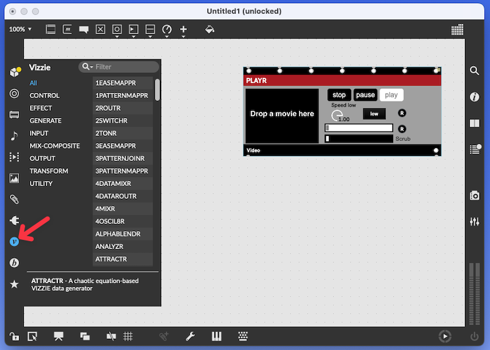

Follow along sections 1.1 to 1.3 to build your first Vizzie patch. Each step provides a running patch, try it out to make sure that you have patched everything correctly. Further hints on what to look for can be found in the video link above.

### 1.1. Simple Player
1. INPUT/`PLAYR` - Module allows changing the speed, select a part of the video to be played and set a loop.
2. OUTPUT/`PROJECTR`

##### MAX comes with a video collection. 
You find it also on the left side of the screen.

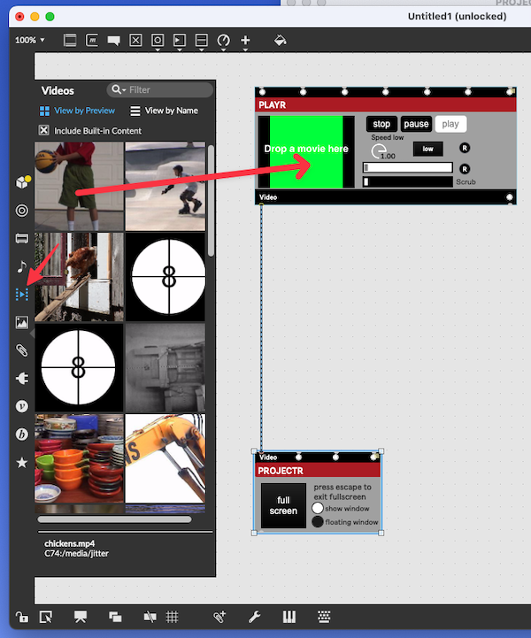

### 1.2. Add Effects
1. EFFECT/`BRCOSR`
   Allows modifying the brightness, contrast and saturation of videos.
2. EFFECTS/`DELAYR` - Delay, apply feedback to the delay and crossfade/mix original and delayed signals.

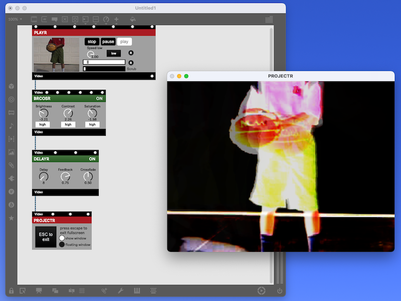

### 1.3. Add Randomness to the Effects

1. GENERATE/ATTRACTR

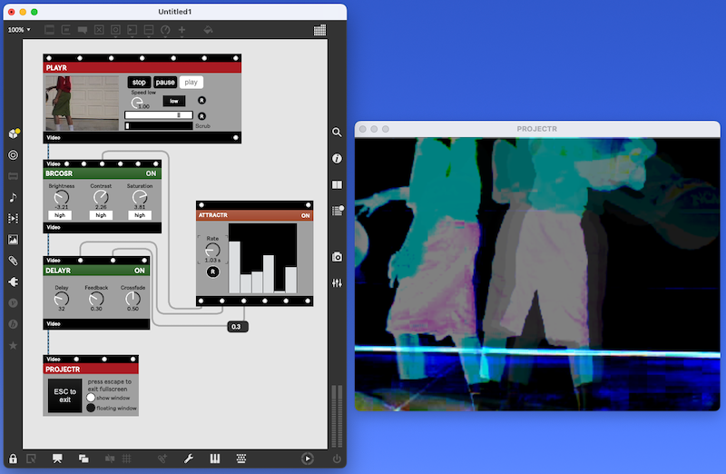

## Session 2: Video Effects, Remixes with BEAP, Recording, and Even More Vizzie

*This session is taking inspiration from*

- [Vizzie Visions: Part 2, BEAP Modules](https://youtu.be/xcs-kKaN6QQ)
- [Max MSP Tutorials for Beginners: Vizzie #4 Effects Tour](https://soundand.design/vizzie-4-effects-tour-b39b3cd4e29)

Follow along sections 2.1 to 2.5 to build more Vizzie patches. Each step provides a running patch, try it out to make sure that you have patched everything correctly. Further hints on what to look for can be found in the video link above.

### 2.1 Patch using different types of signals

This patch introduces different signals and ranges/amplitudes for those signals that MAX objects use to communicate between each other. Often they are derived from existing standards in the analogue hardware based world. All values are digitized inside the computer.

As a first orientation, you can always refer to the colouring of the patchcords, each type only allows one particular family of signal to go through.

- MAX patch cords are grey and transfer bangs, integers, floats, and lists.
- MSP (BEAP) patch cords are black-yellow stripped and transfer sound data.
- Jitter (Vizzie) patch cords green-black stripped and transfer video textures or matrices.

In the menu under `Debug` you can activate/deactivate probes (`Event`, `Signal` and `Matrix`) that allow you to see the data inside the patch cords by hovering over them.

When using objects, always make sure that they understand the type of data you want to patch them to. Furthermore, even within one family of patch cords, you need to assure that the range of values matches the expectations of the receiving object. Here is a short summary for the ranges expected for various types of data:

- Vizzie Data - Floating Point Numbers between 0.0V .. 1.0V
- Audio Signals (MSP) -1.0 .. 1.0
- BEAP “Control Voltage” CV -5V .. 5V, used for analogue modular synthesizers
- Ramp (special signal here: 0V .. 5V)

The following lists allow you to rebuild the patches in order. Each step is a running patch, try it out to make sure that you have patched everything correctly. Further hints on what to look for can be found in the video.

#### 2.1.1 Basic Video Patch

1. INPUT/`PLAYR`
2. TRANSFORM/`PIXL8R`
3. OUTPUT/`VIEWR`
4. CONTROL/`FADR`

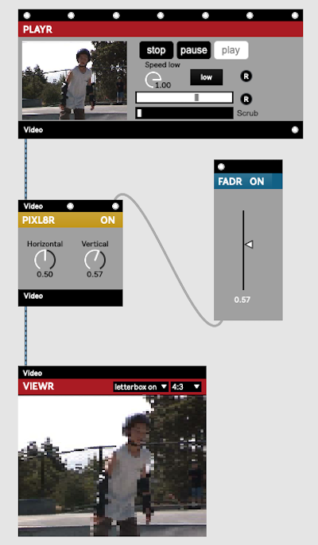

#### 2.1.2. BEAP’s LFO controls the `PIXL8R`

1. In BEAP get LFO/`CV LFO`
2. Enable Audio with the ON button on the lower right of the patch window.
3. In Vizzie get UTILITY/`BEAPCONVERTR`
4. Set in the converter the range to 0..5V.

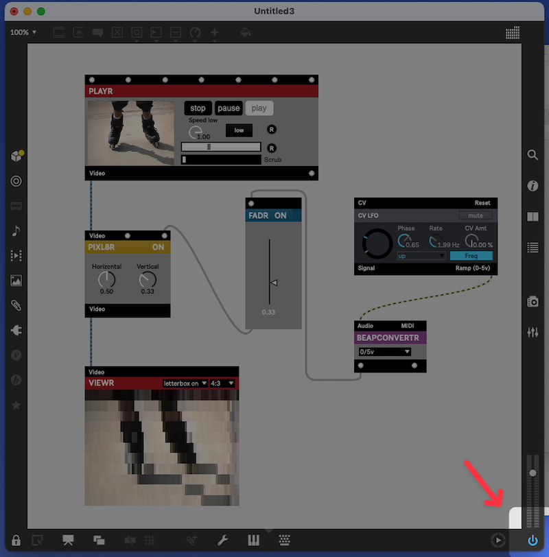

#### 2.1.3. Add audio source

1. Add audio player `n` `playlist~`
2. add new object `n` `live.gain~`
3. add new object `n` `ezdac~`
4. Change range of `BEAPCONVERTR` to -1V to 1V (audio signal range).

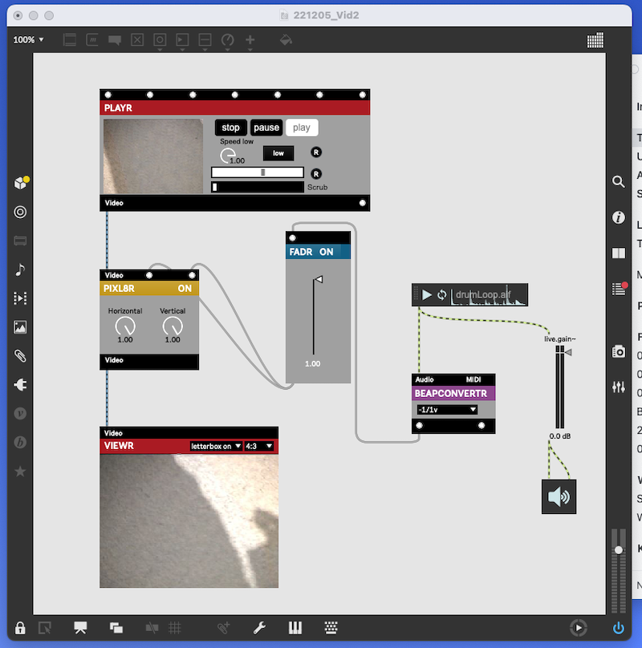

#### 2.1.4. Use `ATTRACTR` to control the LFO

1. Reconnect the CV LFO from step 2
2. GENERATE/`ATTRACTR`
3. UTILITY/`VIZZIECONVERTR`

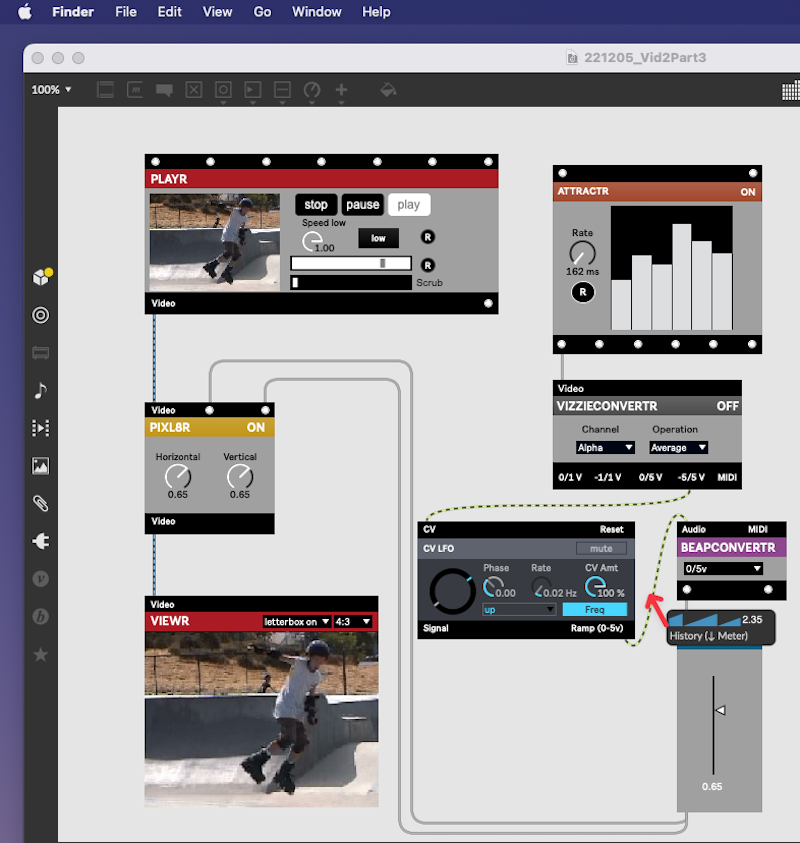

The image shows (red arrow) what you see with an activated `Signal Probe` when you hover with the mouse over the signal patch cord, assuming you play audio.

### 2.2. [Video to Data and Data to Video](https://youtu.be/sbfpLhPTbVI)

  
Compressed Copy

<pre><code>
----------begin_max5_patcher----------
1759.3oc6as0aaaCE94jeEDJOrKv0UjT27dqsXqH.qCEoaYnsnHfVlIlsxjF
TzIwon+2GuHEqjHYK2H4ZfkGhEHEkN76b+bnxWO7.uwhqo4dfeC7QvAG70CO
3.6TlINnX7AdyHWmlQxsKyKULaFkq7F3tmhdsxN+aXWCVJV.DWwAohLwBY4R
lSToSY7KNSRSUNREgQC8G.vAwlKH+Q1K5eAep3g3KlIVnxnJKU8Kl8bAWkyt
gZlC4OrbZ1D6VPL9yOKHwa0afwKeAPybe6vCM+LnkHU+BFSWGJRhhL66PGXB
8sf.0HHPEy5lRsbN08Z77F.7FS3W3c6CVEPgq1ARxLphJOixIiynUYLOdvRu
RSsGHU+U.JLb353AP+J7ffMwCfMwCNOSPT0y.hpUhh5GIZhEFIi5SIJdOWhh
pvC5EIZvNThFaAPPPTeJQQ64RzfJ7fdQh52YRzlhubxqeI3TR1BZN3JlZJve
3PMrKWVFiSSEK3ppBw5XEgACCM7.ngIjX+Ei2XbmJPEi5r.LMBUZNUAdWFaB
UlCH7If2dxwu4jMKgCiwlKvB0b+sAWvtKv43EJkfu1sahQJDNJztOCJ+caUH
azfD5uSLH0FD52wZ.ZL1FOo.nco2myExYDKUhpwbbmf9wV.ux6KgyEJhhoE8
laezQfSYzq.BIXlfyT5qWp0nE.Fe9BE3niJetKIRtdWZenK0Og7ivOcK.jBk
vvHtcEyYWmc6SpW8krb1XVFSs7NpJmet1Fxw8rb8p1BYhzuPmLQRtHOUJxxp
xURyXoeQMUJVbwzpy63eSe3C3twkO7FNpTlsZ4riuXlXBs5VcrPpsyqtlZTj
BzV1wZSFHzZgivEV3IazDeEq8lgVt6PsPTSAuZrZh6cWauMirTiLv+Zbg+Ja
YB4fmAdAmjsLmZ808tkb0T5ML8vSs5KtkA9YcDfeoV+8Aqw.rfeAc+ZuLJpC
py.F167p2qqlJkvAyH7Ejrrk.K9.ZlCnXKCDmaG9h+5E+46+vI.kvNzscL27
NwMtCOKrYdFDacHGgsbKnKTYbvVELo+CRZSFAne8Z0GiCBvers4BDGTTyhCf
nsOWfjdGktj..Zho21C.yWjkAzvVvo5hrkb8szx7YjunE5JvTgjciVykjssr
h.+vJrBjynY63Ecm8vlipF3hphw6znpX7dRREA8UQpqG9v8K328UzsV3iF8i
rFu7TRFE3CfnXcpL.35J2KJ.Ww7XT72a4d0lYMp9bDh9gB0BSgtFpQ6iP0o1
20PMryfZtMh0Z.BdTUYFBG+8V8W8HY2T6SaQYXQh5EnLtqPIduBkEJkknLpq
PIZ+HhShq78DX7NMhCbOIeiDW8.6b3uujugqCx6Z3OZOoGNulpqxfnz0lCx0
LlL5yLmtWYubpuKNykrYxmZgy8ziRrJPQgtxpQ1QvflC7EzjlzmYpytH6LSZ
DKjTid0s+s5UUosOVwQys8AWar+vdQa5UB9kToBbx.vqGXa2yKKzjzU.OWWV
KWkaJo8zi+vGN92ASHJRC5XDSKit4Isr6GQ1UHu63Xs8GrnogMnjgWm6plUo
J39qoWhQ6Pspuy9L+jty8zcRRp3gpm5w7HucWrq+fnA8y+miASX4yyHKA5Ht
sv0x4jIx++I8QibEjUbzn1b9fidT4xWUuvvTWiZwNTq3US0YgYxmw5l3mxAi
krKlp3z77mmJ3JIIW87bhN1p8wZPIYrLUj+jKjZC+fbULTF9A6u8JQ2KGmZU
obhf0jXS8c0HtWzp96ozRWKtvOFGNZuOYBwbproDk0q4Icn50gBcegfNUnvj
sufqZRSt9ziMBgl0hh1nRj8sZOqk68kTZAmY96pYkKVHSK2kkehafU3aBMWw
32pc8wUeHflEUq1aaoj4LL1Lkt61YkL6QQZyW80lIMtK.IrMTJnO.o4TB1Lo
86E9qeaHMpC3usQaEG1GXrMTFVOggONlaafb8DNbmPX3CIbvNgvnGRXbuSXT
vOJgLB2K1tsgxn5oL5w4qLrMlTw2YQyXSlKXbUQzt.6mTINw0xg3fgIw0LNv
O1crO3gnxgcMarcfIZyfIPm8g4xpAcstVqBD2f8Er+iN1fKkGIkuyKsdBOpK
h+2FsfthP3MQHbGQHzlHDrCHTqxeA2GNeQwsgxcAyD0p7W5DtYa7Gg5BMQTq
hfD0ETpMVWkByGGkPsgRcQUQvVk5bWPn1l4Lto3SXe6mNe.zch6wireVv2aH
x8uvCD65nGzdZkOnfUx74WRk4ET2tm8lQ9rvZLmLvNjwcCsGPomjZ5.ga81R
58HRc06Jco61lznqX95H2GfgmozeIeAqvyflacnoiCj7bSs24yIoE8QSbs2g
e6v+CnODTpA
-----------end_max5_patcher-----------
</code></pre>

#### What to do?

Copy and past the Compressed Copy File to a new patcher. This patch contains two parts.

First, change the three sliders and see what happens. Try to create different colours and see how the values in the three boxes displaying the RGB values change, depending on your choice.

Next, reset the sliders to zero by clicking on the button and connect one of the three outlets of `ANALYSR` to one of the three inlets of `PRIMR`. Pay attention to the labels of both modules when patching. Predict what will happen when you are choosing different scenarios to patch the two modules.

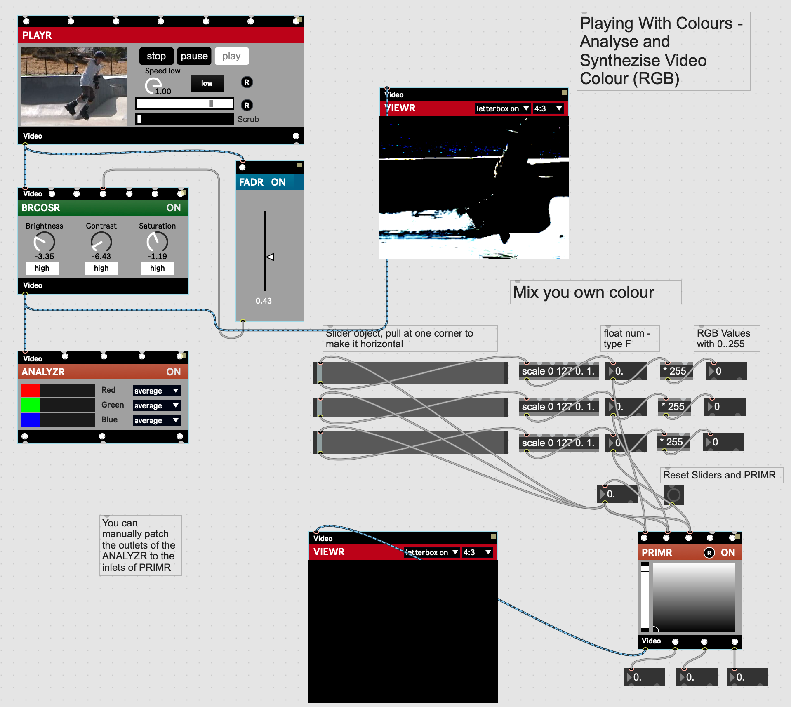

The `slider` and `scale` objects at the right are used to select colour content. While the `slider` provides integers in the range of 0 to 127 (typical for MAX objects), the inlets of the PRIMR object require a signal in the range between 0.0 and 1.0. The `scale` object is doing the transformation.

The three sliders allow synthesizing (mix) the three colour components red, green and blue to get whatever colour you like to get. The result can be seen on VIEWR if there is no signal coming from the ANALYSR module. Reset the sliders and the PRIMR module by banging the button before starting to change the values of the sliders.

The ANALYSR module is extracting / analysing the red, green and blue components of the video and giving values between 0.0 (no colour) to 1.0 (fat red/green/blue) . The number stream coming from its outlets, one for each colour, can be fed into the PRIMR module. 

The MAX Documentation has a [Tutorial](https://docs.cycling74.com/max8/tutorials/jitterchapter05) about ARGB Colours (Alpha or Intensity, Red, Green, Blue). Check it out if you want to know more about the subject.

**Attention:** When you have connected the ANALYSR module to the PRIMR, it will immediately overwrite the settings of the sliders.

## 2.3. [Recombinant Patching]( https://cycling74.com/tutorials/vizzie-visions-episode-4-recombinant-patching-made-easy)

Some Vizzie effects are only available as Abstractions (separate patches), they look like normal objects and are not shown on the Vizzie menu. They are implemented as ordinary objects, and are accessible by creating an object placeholder with `n` and then entering their name. You recognize them by the prefix `vz.`. Each of these effects has a Control Panel that can be opened by double-clicking on the object.

These Vizzie abstractions are also helpful, if you want to use many effects with fixed values and only control whether you apply them or not. For that purpose, you can use the `PATCHROUTR` module.

The patch [221206_Vid4.maxpat](https://github.com/mikefromd/Vizzie_Introduction/blob/main/patches/221206_Vid4.maxpat)can be found in the repository. You can also copy and paste the compressed file from below into an empty new patcher.

  
Compressed Copy

<pre><code>
----------begin_max5_patcher----------
756.3oc6W0zbaBCE7L7qPC9pqq4S6za8POj6cxgjoSFAnXqXYIFgvgjL4+dk
DBak.X6NllKsGLLn2Sr5sZYexu553kxpQkdfuAtC337pqiidH0.Nlmc71Bqy
HvRcZdoEPQ1ZD2aZSPHkxDPAlQ0gmLAbCF8DfwAaYTrPdeGNGw.XZQk.LYR6
71A4T3VjdR6jyX+KrfyDLwyEn8gKv0j8SSl5NbINESvhmUg8MQXO7PIRzTJy
mMep5B3WlfDV1FTdNGtpLiyHDUZyMwxH3rMh0bV0p01iKW.oDz5tSnIvttAZ
PoD+BxdzzUaY4H6kZJimKYPqbzjJlt5dNJyTCwAQppHbg4Vf9VXhUUcf.eYl
lCmI2pjupVxhVsESIHQoM33b8TXoO9E+qrxjUIZSctZv2bcUWldl5BJ5I4qr
2c2WlUtAIqu8awBTsXfPMqB01eCK38HVb+Jx8poTwkC9qgYrvjDEGEDtPcKI
T+PfMeYyGQc4in9oC+wlNxQD3y8xFuOxkPFAKVZQFwK9iIivOIxXCjfv48xF
eHzkPG9KmaqM7ONcD2kNB9jnCLUf3ELxxdYjtQuDRowZwvIlGFjSR5w+X73j
S2V46fHPs7WS6j1pArEJ33ZvCxFM2b8s2d8OFnGidBROdw+1MZ5HW7l9geG8
qnqhm4GErLdg4p+gFT9F+lfAZPcXC3XcoV1yWdCHyh+qHy94ZTqPxnzjNxH9
WILVAhOj3x109+5pdrgNkxx39n8kCizRI+3kCIkTz8wTQK5phR5WDEXIhzX4
QvzOdhX85UM96UVkrJdVa8Zv.bXEmiJEX5dw0cGTypj5U7dt.Ect.Ecg.Edt
.Edg.09RNJRQi.0oAJ3D.ENV.4eJtar.J5D.oNp+3fzojCig9N3bkcAWHP9m
KP9uCnFmBXQwNDuzjsFCY2lGY78Mx7jdRMOpO8jGGor9axW6k5A4RmPgzFTe
VMoWUcRy+BwS44xoUXyIpjUmqxpW1ISYEVV.aJDcCO22b+caZa8q
-----------end_max5_patcher-----------
</code></pre>

This is an example for such an abstraction.

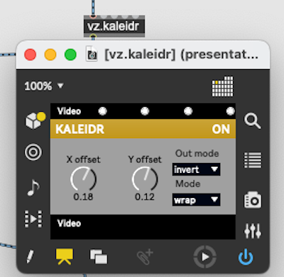

MAX will show you available options once you have typed `vz.` into an object placeholder.

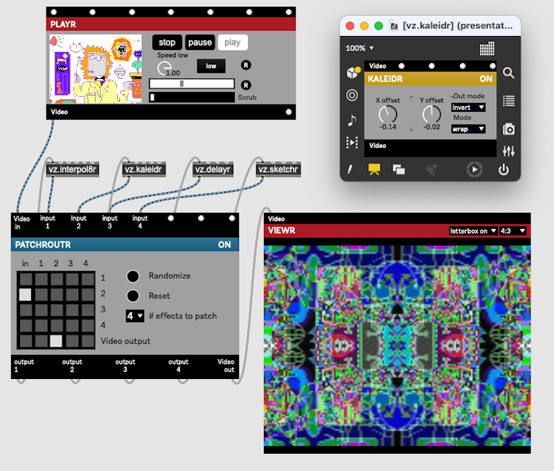

The video shows you how to get these abstractions and use a matrix `PATCHROUTR` to define a chain of abstractions, one executed after the other, in an order you describe. 

The router is arranged in the form of a 5x5 matrix, it determines the daisy chaining of your effect modules. First, you determine the input signal with the row, then you determine the output signal with the column. Select the check box at the intersection of both to route the video signal accordingly.

Here are two examples.

The first example connects the input and output directly, there are no effects applied. The cell at the junction of IN line and OUT line is selected.

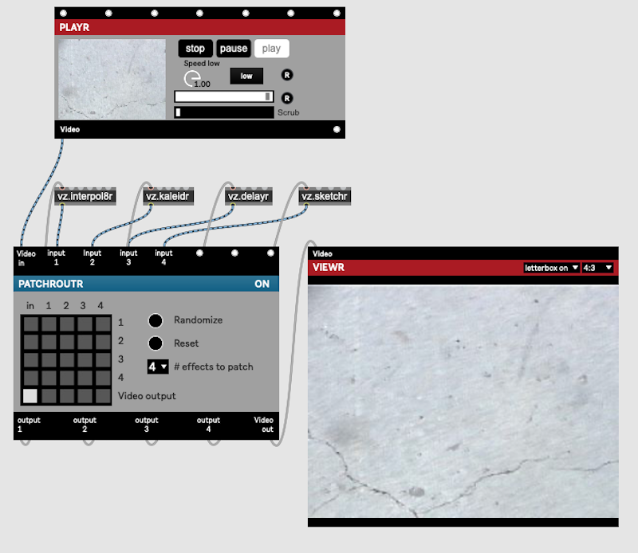

The second example includes one effect. First, the signal is routed from Video In to 4, then from 4 to Video Output. The process of finding the correct cell is similar to identifying (x,y) coordinates, the first value is where the signal is coming from moving along the x axis, the second value where the signal is going to moving along the y axis.

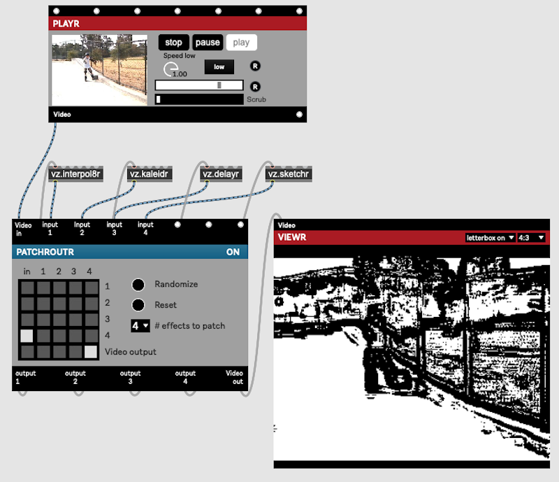

### Where to find the modules?

- INPUT/`PLAYR`
- CONTROL/`PATCHROUTR`
- OUTPUT/`VIEWR`
- The abstractions (Vizzie objects without permanent user interface) are created by making a new object and then typing the name of the abstraction, see explanations above.

### What to do?

- [ ] Get more different effects and patch them using the 'PATCHROUTR` module. [This website](https://soundand.design/vizzie-4-effects-tour-b39b3cd4e29) introduces you to 20 different effects with samples and description.
- [ ] Record one particular exciting video you have created with your choice of effects. 

### 2.4. Use Your Webcam With Vizzie

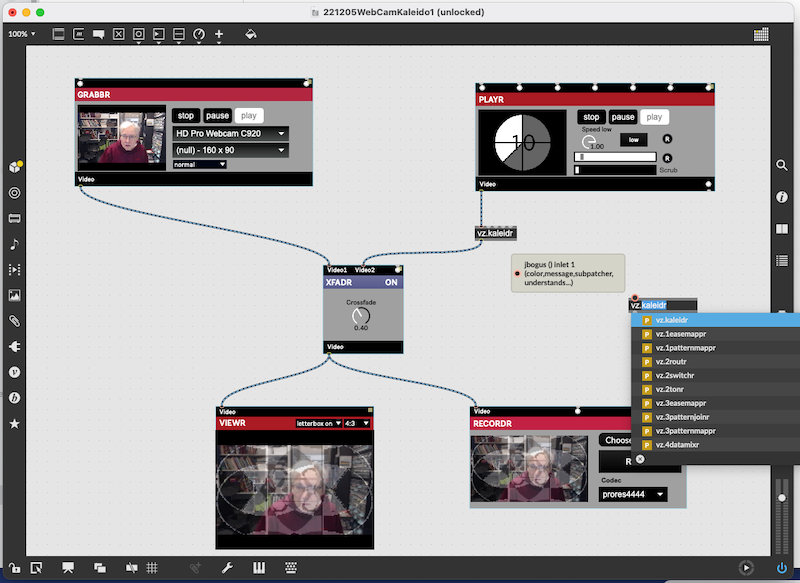

This project is actually a remix of project 3, we replace the `PLAYR` module by the `GRABBR` module. This object gets a feed from your webcam and we add a second video signal from a `PLAYR`. An effect (Kaleidoscope) is applied to the signal from the player. We are using a fader (CONTROL/`FADR`) to mix the two video signals. You can preview the signal “live” on a `VIEWR` module, record it with the `RECORDR` module.

### 2.5. Mixing and applying effects to more than one video

Before you start, find some free to use photo and video clips. You may have a look at [Pexels](https://www.pexels.com/videos/), this website offers free to use photos and videos. Whenever you have a choice, download the media files with a smaller resolution. Then save your media files in a folder on your desktop for easier access, maybe in a subfolder to your MAX patches collection.

This project takes inspiration from [SMC Video Synthesis Workshop 3/4: Intro to Vizzie in Max/MSP](https://youtu.be/Qe1JSHvmh8E?feature=shared)

Use other effects, maybe try again the `PATCHROUTR` to generate your own unique video. Here is the starter code as a Compressed Copy

  
Compressed Copy

<pre><code>
----------begin_max5_patcher----------
978.3oc6Y18aZCCD.+Y3uBqzW6GwIgDXuuIUMsW1l1CsBUYRN.2ZhibLT5l5
+6yejvGCRZJPQqazGhE1Wxk6te2c1o+pcKmA74PtC5CnaQsZ8q1sZYlROQqh
e2xYBYdLijaDyYPFQFOFDNmaWjjlxkDIkmZV9ryPeEh4hDzOt9lat9inYzDf
iN6rR4mQDojIfQXgQxEOpYT3wYzb5.JiJeRKAtXE9vg4fz9Z5do645Kn9EKx
3wO.IIBxn7XAmwzh4VrVLiF+fbrfOcz3UmGRICXv3MuA6By1bAqVxo+DVc1A
ilvSVeFkEo7NqLiwgQSGcmxbKrgH+tZqHJrmdvG2QOfC5shUsvIM6mWV3mtT
EHTOrR2U5zIzTFHMwE+hIoIlahO39Kv3UjjOUVJpqdxma2Ve47CVT+GpfGhK
PS3oToZzF2ooYSkUD80g6EOvLAWxkOkAKVNiNm8OAYfeMjA1Mx.CAdFBIv0L
3GVEZXbh0AF3s.F8Nlfw2g7bfQj.5I9zRtXnhP9BIMgvHWvnO.HX3PkOHuBT
QZdFc++lVrQJsUaM.m6ox6FwtSBykSEpI6WMV0Aa3nNA95Auvt1BNcqfpJ82
0AVQaAr5rcvBuCfkjOZDCbpx1ooxZMXLNZk7GufxqKM2WJIwcArQDJWiDD2Y
CpqFS1e67kSf9LgAzDddLOCrIKE0VmPFApLIVhxzqHw4Ay8JtE2+TpyNl5z0
yTP120.T3t1TGe2JRcJ730k4zYSZKx4HBTea5fDplgVqIspZLR4yISTNejbL
fxnPLTUE4BIOUQdOqHWfUddEUjqBqJ820wUgaxU9GUtRJ.kHW8HQjgH0ty+b
qnmvmcEeh5X5jGVzO2s9hRkt6WYUodNuuZychl10hQtAKoo2nVb3iZOtOoNq
wE1FaVLZBcNHp.eBTKdBd1U3Aq9yTEx1QqrUVk3iwaWG7zcS3wCeLgmuq18y
Ze9pLF4IPbEiqpMUEDokQbq2oMZWGGcNxoVVpGdkio5GXIoNUcLUiK+UdFUu
sCRd+sARmNw1A.jJ1c8aBHgee.Rmnn8lhBe6pFE9xPjQWNLZ5e9+ow79pmec
xJWsym3R6s7qxgV9Jm.4RZ5B551kMXQdn9akdapl7ZfhJea1OEgahlVWnkvw
QP081tpw6kpiZZbDumtW+FnnnCPXrItR+Cfd50TG2daPMID06.nnvl.gaFhr
0RHYYy.QdgzFcn5GcOWrXy2NppV1eZ9lRNBP2bvJuoZqCQnpUJUEJMmNPUMa
dXfi8VUUkEoSoE7tx5ZqaFn50oKVlmQrFhokX6ma+avKh9Yr
-----------end_max5_patcher-----------
</code></pre>

## Session 3: Under the Hood - Jitter

### Basic concept of Jitter

Jitter operates with matrices. They can be of many dimensions (Ex. x, y), number of planes (Ex. 4,ARGB) or data type (Ex. char -> 0..255). The object declaration of a matrix we can use for a colour video with ARGB values, 320 x 240 pixels is as follows:

`jit.matrix 4 char 320 240`

Here, we have 

- four planes (three of them containing the RGB colour coding, the forth a parameter called alpha value determining the transparency or opacity of the colour)
- char is a data type using whole numbers in the range from 0 to 255 (8bit, 1 Byte)
- 320 x 240 is the number of pixels horizontally x vertically being used.

The attached basic patch contains a colour random generator and a black and white pixel controller that allow you to explore Jitter. You can change each element of the matrix by addressing it with its index, (0,0) is the first element on the left of the first line. You need to *bang* the patch for changes to become effective. It is important to  The patch is also available as Compressed Copy below.

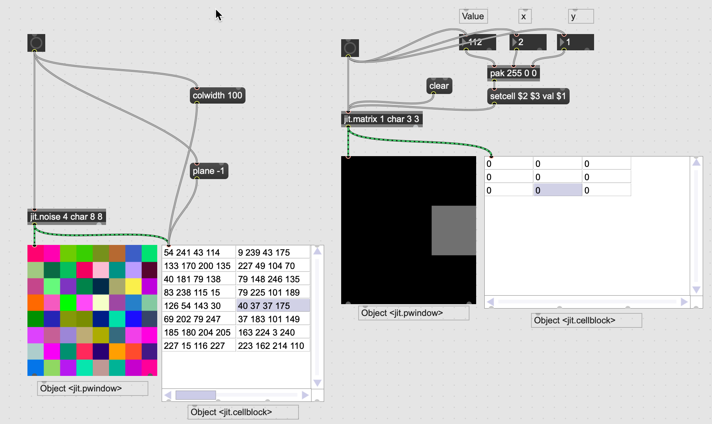

  
Compressed Copy

<pre><code>
----------begin_max5_patcher----------
978.3oc0X00aaBCE84jeEVn9XZksALISSSZ+B1a6kooJGhaKofAAllzU0+6y
ePZIqjDyWoYOTRiiMm645683C7xzINKS2xJb.eA7KvjIuLcxD8PpAlT88INI
zsgwzB8zbBSSRXbgyLyuIXaE5w+wx0rPA3qqiD2DxhiWFmF9321MMdYRZoHl
Iz2DX0nYTQ3CQ76uMWtTSPDfVbCbFvCOW8AxGp9.KuB9c0hhVowKc45q8v0t
+Q7c2djZrWmNUcY1.RqrMQ7UoaZOo7lSzjBYEoPmUR0i8Jru+M9y.99XanE7
+i8JIYTbBCsfStyGLNkvJJn2y9.mBiYz7lIA5HjHvTogzguqulD3ZjvbaDOm
wLKvwoQ9QZje3AbO641qPPzJDnfZT6P6OdidM211G+PjpByD+FEgCF+iu91O
owkrVyABFWaOXwQ4vv02Wqut4HFeDIXhqNJQDSZGahY3w5Ij3caBUjGI2jOP
GB9MEfhm4g06JGOEgz3MQqDO.PPXqEFv9llGrNaDzUgAbvfILbHZlES4Lv0n
tRQLVSNyYScghdiNEKXB0oufqvfqbAOQk+W6oKgXNoB6YT7QckunAiub1F4c
7i6nzGUVF.P.rqrbgorsqbDsnQN51ENVlrjk2ZYn.e81julAUlKNNOjJOKo7
6alOuc9bFMmlvDr7aYb5xXVc86dqD0QtRV.GRt5cQyUyAhCEWwmEttm8+cHl
mtQ+qyaLE3UMp7Pn8l0cobAWFo5662yinwNGQgFqSSttDyQxF8ZzQyWwQEB8
ov696sot67PcV.BqEP2QC2KgUOC2rqDbsUWD8G8pUwUGRtKKEhTdqE57p0yX
jzUWObd4f0PKNOsKMK0qpr3oQELfGH7AZNXNXd6srYZilaLJCImtoxBCaAWF
tQg0Z.PFaXnffdxMxn4E8nJEtVoT31EkBhOolqc7hpm1izMkhSnI3eoJIXdz
E+48VSv6yVSvT.CPFQAWfaWeNNjuesWvQuUEN8qbSuJYsE+eeao5XTM99Yjh
zx7vcQPEDf2CxUrBQDmJhj0CuOG0SSVaRo4qjVQN3tfsH6YAxnlA1sW.aCk8
aFXXu.Firmx8BH0KH6r.j5IWNc4yffjUTREN39hjmsHg5KRXaQpuYOqnDYLp
4sBYuOM8EbyHi6WedfMPCGf8UqZ+BFirK16hhidiQsaa1FGVjsgyAiQoqMTl
b55IisDZV1Sr7hpUqwTZIacZ9aOhtizVi4qD8WyYOEsa9ZqmNzboUKgzmUYt
wa9VhwtnSRpDXdYTE1R1JgTa2S4iuHqxQs1U3zWm9W.P.39r
-----------end_max5_patcher-----------
</code></pre>

In this session I encourage you to try out the examples of previous sessions, have a look at the documentation and get a better grip on Jitter, MSP and MAX.

The best way to explore is to check out the tutorials inside MAX. You can access them by first clicking on the `File Browser` icon on the left side of the MAX window and then click on the `74` item.

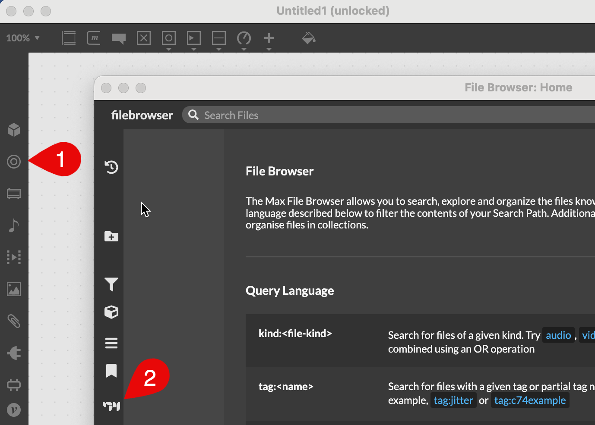

There are tutorials for may different topics covering Jitter. There is a basic series to give an overview called *Video and Graphic*, the *Tutorial* series covers more details.

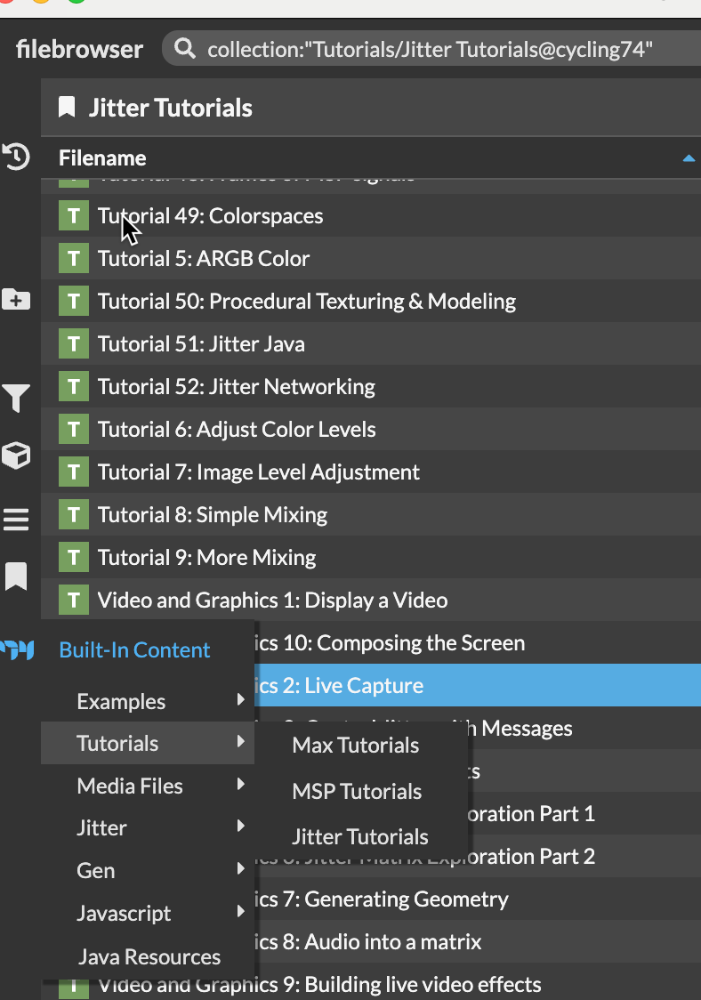

Each tutorial comes with patches to try out the features explained. After opening a tutorial, click on the `Open Tutorial` button on the top left, this will open the patch.

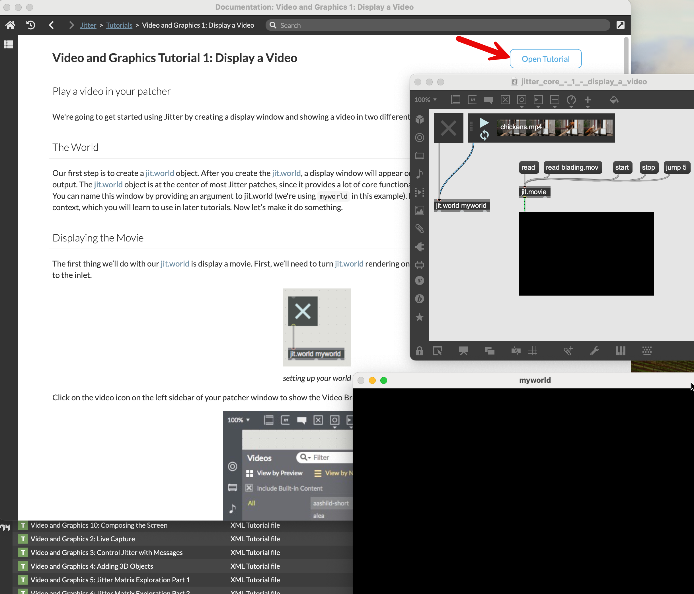

The [MAX Cookbook](https://music.arts.uci.edu/dobrian/maxcookbook/chapter/jitter?page=9#:~:text=The%204%20planes%20of%20the,numbers%20from%200%20to%20255.) is a further source of easy and more complex sample patches that you can try out to better understand how Jitter works.

## Session 4: Some things to try out - Bring MAX, MSP and Jitter together

### 4.1. Chromakeying

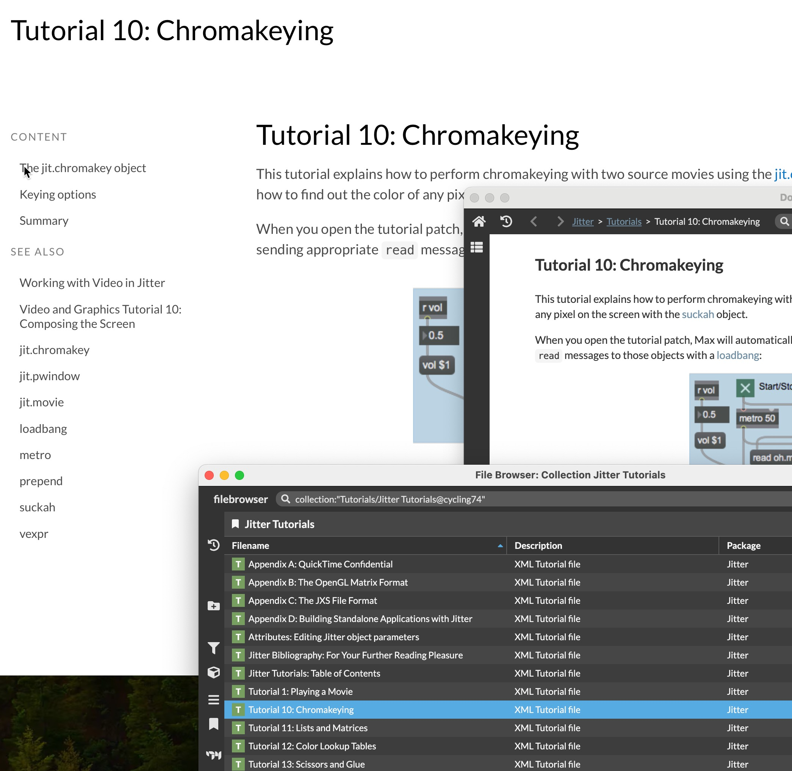

Chromakeying allows to set a delimited object coming from one video source to be set in front of another video source. In order for the algorithm to work, the object has be be placed in front of a uniform green or blue background. These two colours are preferential as the object (in this example the profile of a head) do not contain these colours, therefore the Chromakeying object can just identify all pixels of this colour and replace them with the pixel from the second video source having the same coordinates.

#### How to use the patch?

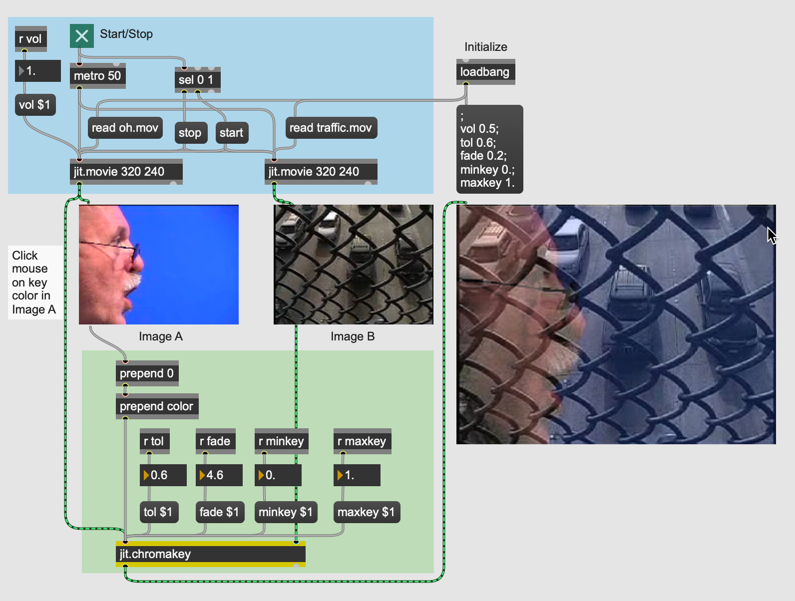

We use two videos, they are loaded by clicking on the messages `read oh.mov` and `read traffiic.mov`. The `Start/Stop` toggle starts the patch, the `start` and `stop` messages allow you to pause and resume the videos.

The patch also allows to play the audio tracks of the media files using the `jit.movie` object, the volume is adjusted by the attribute *vol*, it having a non-zero value will play the sound. If you do not hear the audio, check in `Options/Audio Status`.

The `loadbang` object at the right will initialize the available attributes with suitable values. If you have messed up the attribute values, you can always come back here to find the original settings.

There are four attributes that determine the quality of the keying: `tol`, `fade`, `minkey`, and `maxkey`.

Before you start using these attributes, set the key colour by clicking on it using the left window (i.e. the blue background).

`tol` determines a variance around the chosen colour to be used for the keying in %, expressed as a floatnum in the range of 0.0 to 1.0. Changing the value of the *fade* attribute will allow you to determine what happens at the border between your chosen image (i.e. face) and the background image (video 2). The `maxkey` attribute sets the strength of the righthand matrix in the output, while the `minkey` attribute sets the strength of the lefthand matrix. The values have a range between 0.0 and 1.0..

For further details, please check the tutorial about [Chromakeying](https://docs.cycling74.com/max8/tutorials/jitterchapter10) on the MAX Documentation gives you more details on the patch.

### 4.2. Drawing 2D objects with jit.lcd

The `jit.lcd` object allows to make simple 2D drawings, similar to what the turtle graphics library was doing in Python.

A good approach to learn about this object is opening the `Search Bar` at the right side of the MAX window and then click on *jit.lcd* to open the help file. Next, save that patch with `Save As ...` at a location of your choice with a name of your choice.

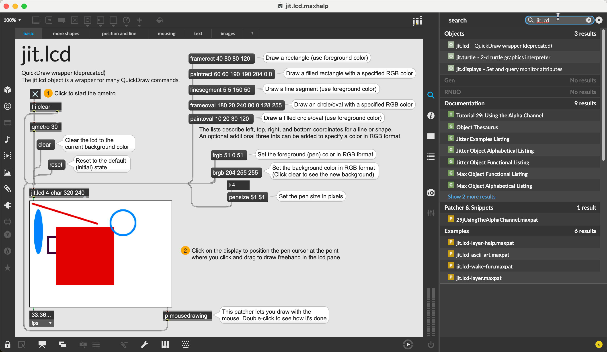

Please note that the help patch (andi its copy) also have *Tabs* at the top, the *Tab* `more shapes` contains interesting messages.

Drawing takes place by sending messages to the `jit.lcd` object. You get the full list of available messages by unlocking your patch, clicking on the `jit.lcd` object and then clicking on the right side of the MAX window on rhe `Reference` icon (red circled).

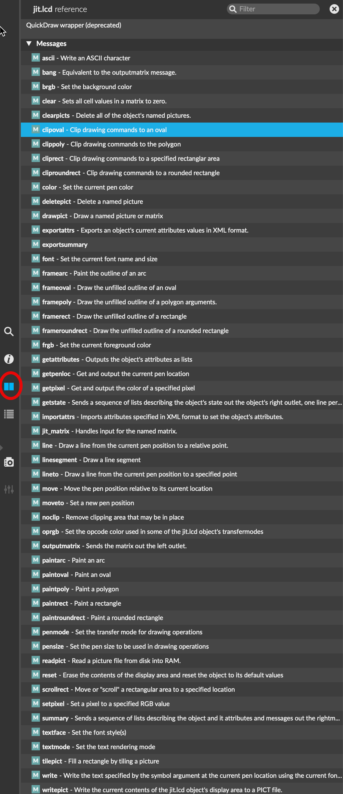

The messages normally contain either or both of location in (x,y) format and colour (RGB coded, range 0..255). Please bear in mind that the coordinate system starts with (0,0) at the top left corner, x values get bigger towards the right side of the panel, y values get bigger towards the bottom of the panel.

As an example, look at 

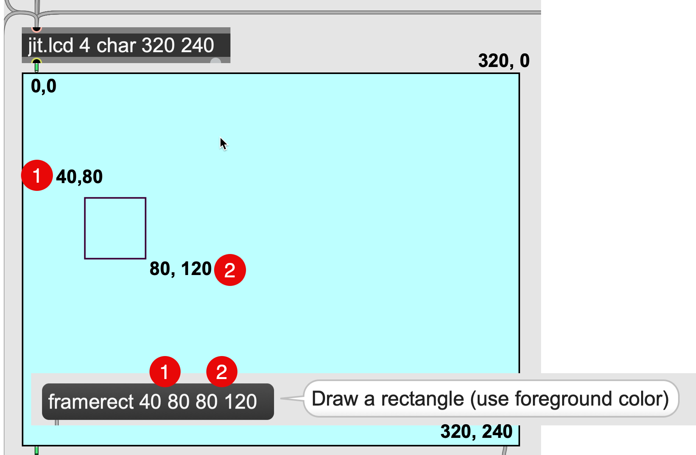

`framerect 40 80 80 120` draws a rectangle with the top left corner at coordinates (40, 80) and lower right coordinate at (80, 120). All this is and more is explained in the documentation.

Some objects (i.e. `paintrect 60 60 190 190 204 0 0` contain three more arguments, they represent the colour of the object, RGB coded).

Some messages (`frgb`, `brgb`, `pensize`, ...) set default value that will be used until they are changed.

#### ToDo (two choices):

##### Draw a Mondrian inspired image or

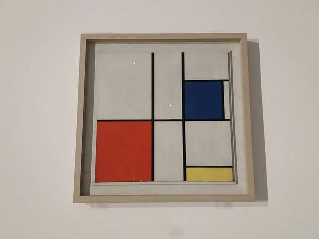

The below code may help you to change arguments quicker, it takes the values of four integer boxes, packs them into a list. When you change the value of the leftmost box, the values will be send to the jit.lcd object and the image will be updated with the new values. You can easily extend it to hold 7 values by adding more *0* values.

##### Draw a smiley.

Beside the basic shapes (`frameoval` and `paintoval`) you also need a message to draw the mouth, have a look for `framearc`, you find an example in the help section under the *Tab* `more shapes` The message also includes two arguments that control the arc. The first argument is the angle to the starting position of the arc, 0 degree is at 12 o'clock, angles increase clockwise. The second argument is the length of the arc section in degree.

#### Further details:

- [MAX Documentation on jit.lcd](https://docs.cycling74.com/max8/refpages/jit.lcd)
- [Soundand.Design - Jitter basic lines shapes typography](https://soundand.design/jitter-2-basic-lines-shapes-typography-picts-5f43f89e8b13)
- [Jit.lcd - Max MSP Tutorial - Intro to Jitter by Andrew Robinson, YouTube](https://youtu.be/98FpSRsWvFE?feature=shared)

## Some Background Knowledge

### Copyright, Creative Commons, Public Domain, and Fair Use in a Nutshell

#### Copyright

All works (books, music, videos) are protected by law, and another person can only use it if agreed by the creator of said work. When you buy a book, you typically find some limitations on what you can do with it at its beginning. If there is no reference to any rights, the work may still be protected by copyright laws, so you need to get the approval if you want to use it.

#### Public Domain

Works in the Public Domain can be used by whomever as they like. Many of the classics (Shakespeare) are in the Public Domain. [Here](https://en.wikipedia.org/wiki/Public_domain) you find more about it.

#### [Creative Commons](https://creativecommons.org/share-your-work/cclicenses/)

Under the Creative Commons License, the creator keeps the rights (control) on his work, but makes it easier for others to use his work without the need to get directly in touch with him/her. There are different types of sublicenses under this licensing system. The simplest license is a CC-BY license where the person using someone elses work only has to mention/credit/appreciate the original creator of the work. It is important that the creator publishes the proper license he/she wants to grant to others.

#### Fair Use

This is no right/license to use for a work by itself. Many countries allow the use of copyrighted work in very restricted ways for educational purposes, that's called Fair Use. [This](https://www.ipd.gov.hk/filemanager/ipd/common/copyright/FAQs-2007-copyright-exemptions-en.pdf) document describes the situation in Hong Kong (2007). Q3 tries to describe the limits of a Fair Use, copyrighted materials cannot be used for commercial purposes, furthermore, it should be clearly restricted in its quality and quantity to be used for education only.

#### How to find materials you can use?

When you search images on Google, enter your search terms, select `Images` and then click on `Tools`, select 
`Usage Rights`.

When on Youtube, enter your search terms, open the `Filters` section and find the licence link. This video by the [Langara Library CC-BY](https://youtu.be/b7UZELEunow?feature=shared) shows you how to find content under the Creative Commons license in more detail.

When on Vimeo, enter your search terms, open the `Filters` section and find the licence link. This video by the [Langara Library CC-BY](https://youtu.be/lID2eDz4j0g?feature=shared) shows you how to find content under the Creative Commons licence in more detail.

## NEW: Source Files in Compressed Copy for some more patches.

Some patches here are provided as Compressed Copy. Just open a new patcher on MAX, then click on the Copy icon at the left top of the panel. Then, when your mouse hovers over your empty patch, right-click your mouse and `Paste` the content on your patch. After a short while, the patch will become visible. The first thing to do may be saving it, then start to remix it. Please note that the patch only contains the code, you will need to add the media files by yourself.
